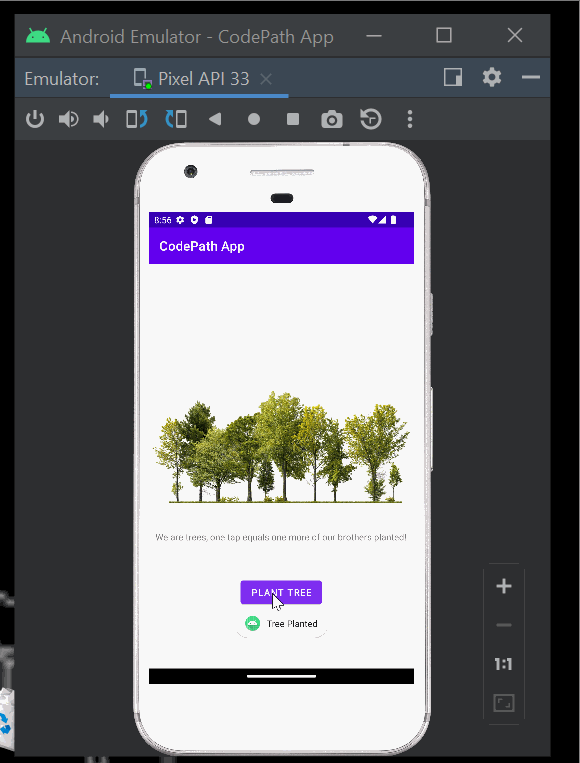

# Android Prework - *Plant a Tree*

Submitted by: **Terry Tong**

**Plant a Tree** is an android app that shows an image and introductory message, and allows pressing a button to display a Toast. 

Time spent: **6** hours spent in total

## Required Features

The following **required** functionality is completed:

* [x] Image and introductory message displayed on screen
* [x] Button displayed on screen
* [x] Toast with message appears when button is pressed 

The following **optional** features are implemented:

* [x] List anything else that you can get done to improve the app functionality!

      - I tried to add a personal touch by making it environment related, which is something I am passionate about. 
      
      - The next step would be to try to improve the UI/UX by design in Adobe XD, then connect it to an API that does plant trees and by clicking the button and perhaps donating some money, the 
      user can end up planting a tree. 
      
## Video Walkthrough

Here's a walkthrough of implemented features:

<!-- Replace this with whatever GIF tool you used! -->
GIF created with [LiceCap](http://www.cockos.com/licecap/).  
<!-- Other options include:
[Kap](https://getkap.co/) for macOS
[ScreenToGif](https://www.screentogif.com/) for Windows
[peek](https://github.com/phw/peek) for Linux. -->

## Notes

Describe any challenges encountered while building the app.

When reassigning the names to the TextView, ImageView and Button IDs, the constraints sort of reset which caused problems because they were all attached
to each other relatively. 

There was a bug in the Logcat that was continuosly failing in a circular manner which made it hard to debug. 

Had some issues with the emulator and getting it to work. For example, I had to wipe data from disk because once it exceeded 7GB it started to cause problems. 

## License

    Copyright [yyyy] [name of copyright owner]

    Licensed under the Apache License, Version 2.0 (the "License");
    you may not use this file except in compliance with the License.
    You may obtain a copy of the License at

        http://www.apache.org/licenses/LICENSE-2.0

    Unless required by applicable law or agreed to in writing, software
    distributed under the License is distributed on an "AS IS" BASIS,
    WITHOUT WARRANTIES OR CONDITIONS OF ANY KIND, either express or implied.
    See the License for the specific language governing permissions and
    limitations under the License.
